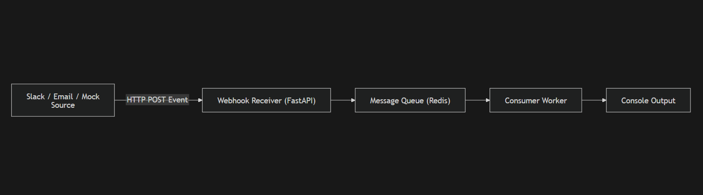
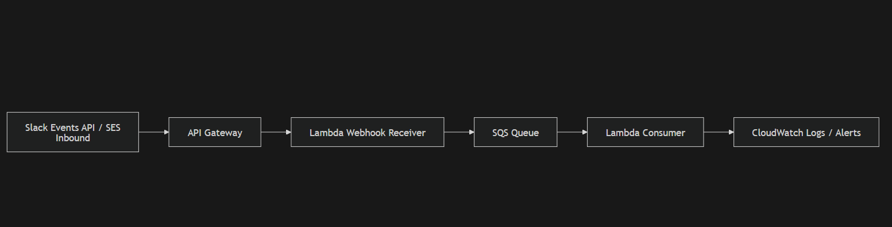

# scalable-status-monitoring-system
How to scale things to monitor 100+ systems 

# Status Monitoring – Event-Driven Pipeline

This project demonstrates a **near real-time, event-driven architecture** for tracking updates from the **OpenAI Status Page**.

Instead of inefficient polling, the system leverages **push-style notifications** (Slack / Email) and processes updates asynchronously using a **Webhook → Queue → Consumer** pipeline.

---

## Problem Being Solved

Automatically detect and log:

- New incidents  
- Outages  
- Degradations  
- Service updates  

And print:

```

[Timestamp]
Product: <Affected Service>
Status: <Latest Update>

````

---

# Local Architecture (Push-Based)



---

# AWS Architecture (Minimal Cost)



---

# Why This Architecture Is Near Real-Time

Traditional feed polling:

- Delay depends on polling interval
- Wasteful API calls
- Scaling issues

Push/Event-driven pipeline:

- Updates delivered instantly
- No tight polling loops
- Efficient resource usage
- Horizontally scalable

Slack / Email already act as **highly reliable notification systems**, so we reuse existing infrastructure instead of building custom scrapers.

---

# Key Design Advantages

- Event-driven
- Loosely coupled
- Scalable
- Minimal latency
- Minimal cost
- Provider-independent

---
## Estimated AWS Cost (10,000 Events / Month / Source)

The following estimate assumes:

- **10,000 status events per month per source**
- Each event triggers:
  - 1 webhook invocation (API Gateway → Lambda)
  - 1 queue write (SQS SendMessage)
  - 1 queue read (SQS ReceiveMessage)
  - 1 consumer execution (Lambda)

---

### AWS Free Tier Impact

Most workloads of this size remain **fully within AWS Free Tier**:

| Service | Free Tier | Usage (10k events) | Cost |
|---------|-----------|-------------------|------|
| **AWS Lambda** | 1M requests/month | ~20k invocations | ₹0 |
| **API Gateway (HTTP API)** | 1M requests/month | ~10k requests | ₹0 |
| **Amazon SQS** | 1M requests/month | ~20k requests | ₹0 |
| **CloudWatch Logs** | 5GB ingestion/month | Few MBs | ₹0 |

**Total Cost = ₹0 (within free tier)**

---

### Cost Outside Free Tier (Worst-Case)

Even without Free Tier, costs remain extremely low:

| Service | Pricing | Approx Usage | Estimated Cost |
|---------|---------|--------------|----------------|
| **Lambda Requests** | $0.20 / 1M | 20k | ~$0.004 |
| **API Gateway** | $1.00 / 1M | 10k | ~$0.01 |
| **SQS Requests** | $0.40 / 1M | 20k | ~$0.008 |
| **CloudWatch Logs** | $0.50 / GB | ~10MB | ~$0.005 |

**Total ≈ $0.03 / month (~₹2–3)**

---

### Scaling Example

| Sources | Events/Month | Estimated Cost |
|---------|--------------|----------------|
| 1 Source | 10,000 | ~₹0 – ₹3 |
| 10 Sources | 100,000 | ~₹10 – ₹30 |
| 100 Sources | 1,000,000 | Still low (< ₹200 typically) |

---

### Why Cost Stays Low

✔ Fully serverless (no idle compute)  
✔ Pay-per-use pricing  
✔ Lightweight payloads  
✔ Minimal logging volume  
✔ SQS extremely cheap  

---

### Factors That May Increase Cost

Costs may rise if:

- Very verbose CloudWatch logging
- Large payload sizes
- REST API (instead of HTTP API)
- High-frequency burst traffic
- Long log retention

---

**Conclusion:**  
Even at **10,000 events/month per source**, the architecture operates at **near-zero cost**, making it highly economical and production-friendly.


# Running Locally

We simulate a **true push pipeline** using:

* FastAPI (Webhook Receiver)
* Redis (Queue)
* Consumer Worker
* Mock Event Sender

---

## 1. Install Dependencies

Using **uv (recommended)**:

```bash
uv sync
```

---

## 2. Start Redis (Docker)

```bash
docker run -p 6379:6379 redis
```

---

# Run the System (4 Terminals)

---

## Terminal 1 – FastAPI Webhook

```bash
uvicorn app.main:app --reload
```

Runs webhook server at:

```
http://localhost:8000/webhook/status
```

---

## Terminal 2 – Redis Container

(Already running from Docker)

---

## Terminal 3 – Consumer Worker

```bash
python -m app.consumer.py
```

Expected:

```
Consumer started...
```

---

## Terminal 4 – Mock Event Sender

```bash
python -m mock.sender.py
```

Simulates Slack/OpenAI updates.

---

# Expected Output

Consumer logs:

```
[2026-02-21T10:15:00]
Source: OpenAI Status (Mock)
Product: OpenAI API - Responses
Status: Degraded performance
------------------------------------------------------------
```

---

# Components

| Component   | Role                 |
| ----------- | -------------------- |
| FastAPI     | Receives push events |
| Redis       | Message queue        |
| Consumer    | Async processor      |
| Mock Sender | Event simulator      |

---

# Event Flow

1. Event source sends update
2. Webhook receives payload
3. Event pushed to queue
4. Consumer processes event
5. Logs printed

---

# Deployment Path (AWS)

Replace:

| Local       | AWS                  |
| ----------- | -------------------- |
| FastAPI     | API Gateway + Lambda |
| Redis       | SQS                  |
| Consumer.py | Lambda Consumer      |

---

# Solution 2 (Alternative – Not Preferred)

A simpler design using **RSS Feed Polling**:

```python
feedparser.parse("https://status.openai.com/history.atom")
```

### Drawbacks

- Updates only detected at polling interval
- Potential latency (minutes/hours)
- Inefficient at scale
- Not truly event-driven

Example issue:

If Lambda runs:

* Every 15 minutes
* Incident lasts 10 minutes

Update may be completely missed.

---

# Why Solution 1 Is Preferred

| Criteria    | Push Pipeline  | Feed Polling        |
| ----------- | -------------- | ------------------- |
| Latency     | Near real-time | Interval-based      |
| Efficiency  | High           | Medium              |
| Scalability | Excellent      | Limited             |
| Reliability | High           | Depends on schedule |

---

# Conclusion

This system demonstrates:

- Event-driven architecture
- Near real-time processing
- Queue-based decoupling
- Minimal AWS cost
- Production-style design

---

# Submission Notes

* Console output only (as required)
* No persistence/UI needed
* Easily extensible to 100+ providers

---

**Author:** Jay Shah

**Purpose:** Service Status Monitoring
